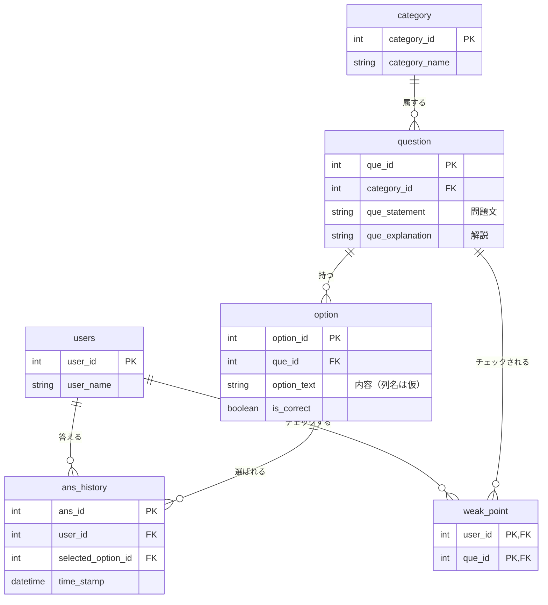

# WebCraft ER図

手書きのER図をMermaidで清書したもの。型は仮で、確定していない。

```mermaid
erDiagram
    users ||--o{ ans_history : "答える"
    users ||--o{ weak_point : "チェックする"
    category ||--o{ question : "属する"
    question ||--o{ option : "持つ"
    question ||--o{ weak_point : "チェックされる"
    option ||--o{ ans_history : "選ばれる"

    users {
        int user_id PK
        string user_name
    }

    category {
        int category_id PK
        string category_name
    }

    question {
        int que_id PK
        int category_id FK
        string que_statement "問題文"
        string que_explanation "解説"
    }

    option {
        int option_id PK
        int que_id FK
        string option_text "内容（列名は仮）"
        boolean is_correct
    }

    ans_history {
        int ans_id PK
        int user_id FK
        int selected_option_id FK
        datetime time_stamp
    }

    weak_point {
        int user_id PK, FK
        int que_id PK, FK
    }
```

## 関係（1:N）
- 問題 ― 選択肢
- カテゴリ ― 問題
- ユーザー ― 解答履歴
- 選択肢 ― 解答履歴
- ユーザー ― 苦手
- 問題 ― 苦手
